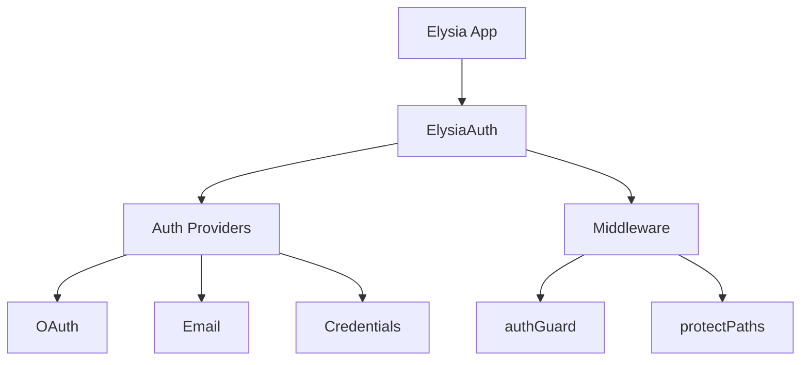

# About @auth/elysia

## Project Overview

@auth/elysia is an authentication middleware designed specifically for Elysia.js applications. Built on top of the robust [@auth/core](https://authjs.dev) library, it provides a seamless authentication experience while maintaining the performance benefits of the Bun runtime.

## Key Features

### 1. Authentication Providers
- Support for 50+ authentication providers
- OAuth integration (Google, GitHub, Discord, etc.)
- Email/Password authentication
- JWT-based sessions

### 2. Middleware Solutions
- Route-specific protection with `authGuard`
- Global path protection with `protectPaths`
- Flexible configuration options

### 3. Type Safety
- Full TypeScript support
- Type-safe configurations
- Custom type definitions

### 4. Performance
- Optimized for Bun runtime
- Minimal overhead
- Efficient session management

## Architecture

@auth/elysia is built with a modular architecture:

## Contributing

We welcome contributions! Here's how you can help:

1. Fork the repository
2. Create a feature branch
3. Make your changes
4. Submit a pull request

## License

MIT License - feel free to use in your projects!

## Support

Need help? You can:

- [Open an issue](https://github.com/yourusername/auth-elysia/issues)
- [Join our Discord](https://discord.gg/your-server)
- [Check the documentation](/)

## Credits

This project is made possible thanks to:

- [Elysia.js](https://elysiajs.com)
- [@auth/core](https://authjs.dev)
- [Bun](https://bun.sh)
- All our contributors!
